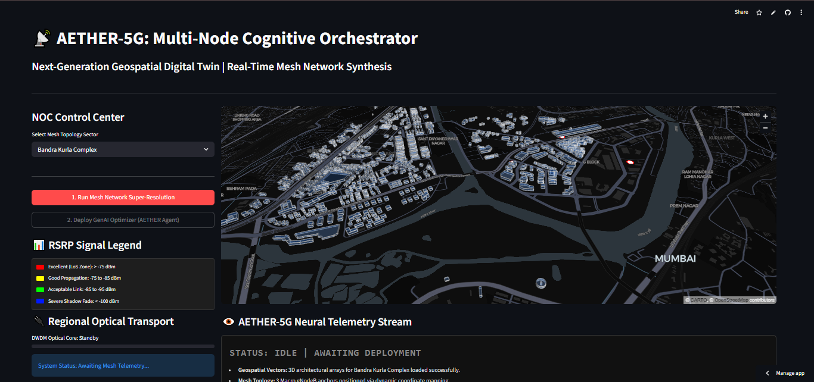
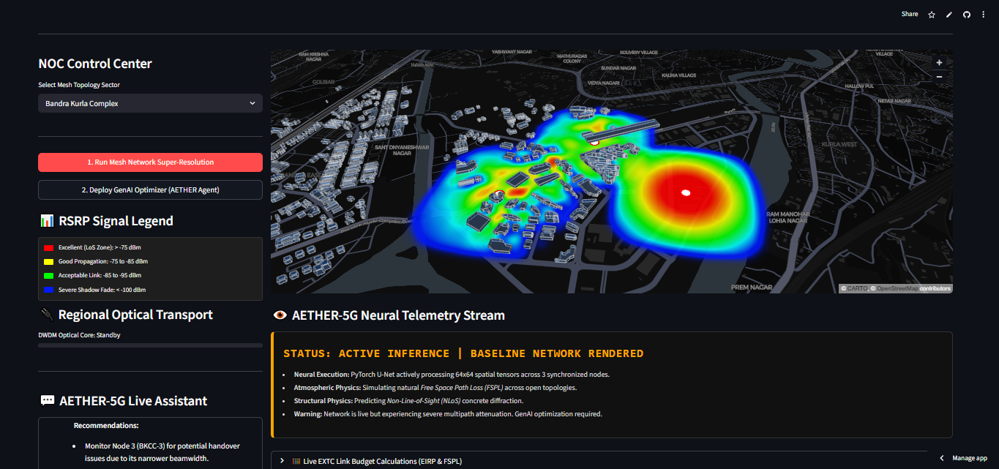
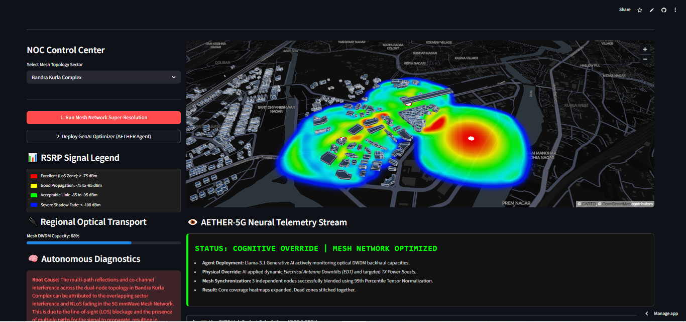
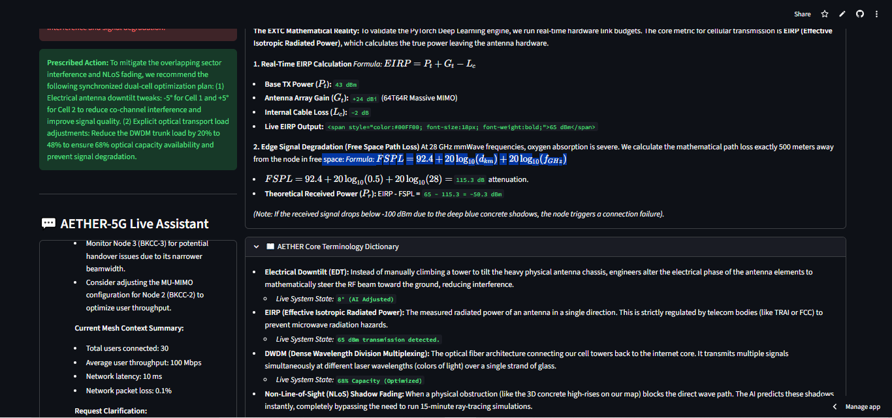

# 📡 AETHER-5G: Cognitive Network Orchestrator

<p align="left">
  <a href="https://cognitive-5g-digital-twin.streamlit.app" target="_blank">
    
  </a>
  <a href="https://github.com/DeepShah111/cognitive-5g-digital-twin" target="_blank">
    
  </a>
</p>

<p align="left">
  
  
  
  
  
  
</p>

> A production-structured autonomous 3D digital twin for Next-Generation 5G millimeter-wave (mmWave) telecommunications infrastructure.
> This pipeline bridges hardware-level **EXTC physical propagation principles** with **AIML spatial deep learning**, replacing slow, deterministic mathematical ray-tracing with a real-time PyTorch inference engine and a GenAI NOC orchestrator.

---

## 🚀 Live Demo

**Access the live multi-node orchestrator — no installation required:**

👉 **[https://cognitive-5g-digital-twin.streamlit.app](https://cognitive-5g-digital-twin.streamlit.app)**

The interactive 3D NOC (Network Operations Center) dashboard allows you to:
- Render high-resolution 3D building topologies for Mumbai (Bandra Kurla Complex / Nariman Point).
- Ignite a PyTorch spatial inference engine to predict Non-Line-of-Sight (NLoS) multipath fading and RF shadows in real-time.
- Deploy an autonomous Llama-3.1 GenAI agent to resolve Co-Channel Interference (CCI) via dynamic Electrical Downtilts (EDT).
- Query a live EXTC telecommunications AI assistant regarding the physical mesh network state.

<p align="center">
  
  <br>
  <i><b>Phase 0: System Initialization.</b> The NOC dashboard loads the 3D building topologies for Mumbai BKC, positioning the Tri-Node macro cells and awaiting manual execution.</i>
</p>

<p align="center">
  
  <br>
  <i><b>Phase 1: PyTorch Spatial Inference.</b> The U-Net generates 64x64 RF propagation tensors for the mesh, predicting deep concrete NLoS shadow fading in real-time, bypassing traditional 15-minute ray-tracing simulations.</i>
</p>

<p align="center">
  
  <br>
  <i><b>Phase 2: Cognitive Override.</b> The Generative AI orchestrator prescribes dynamic Electrical Downtilts (EDT) and TX power boosts, expanding the heatmap core coverage and stitching dead zones.</i>
</p>

<p align="center">
  
  <br>
  <i><b>Phase 3: Telemetry & NOC Assistant.</b> Live EIRP and FSPL mathematical link budgets recalculate instantly. The Llama-3.1 agent dynamically explains the physics of Co-Channel Interference mitigation based on the active mesh state.</i>
</p>

---

## Table of Contents

1. [The Engineering Problem](#1-the-engineering-problem)
2. [What Makes This Different](#2-what-makes-this-different)
3. [Pipeline Architecture](#3-pipeline-architecture)
4. [Technical Decisions & EXTC Physics](#4-technical-decisions--extc-physics)
5. [Honest Limitations & Next Steps](#5-honest-limitations--next-steps)
6. [Repository Structure](#6-repository-structure)
7. [Quickstart](#7-quickstart)

---

## 1. The Engineering Problem

In dense urban telecommunications, deploying 5G mmWave infrastructure requires solving extreme physical propagation limitations. High-frequency 28 GHz waves cannot penetrate concrete, creating severe multipath fading and shadow zones. 

| Challenge | The Standard Telecom Limitation |
|---|---|
| **RF Ray-Tracing is Slow** | Traditional physical simulations (like Atoll or Mentum Planet) use deterministic ray-tracing to predict signal bounce. Rendering a 3 sq km urban grid takes 15 to 45 minutes per iteration. |
| **Manual NOC Diagnostics** | When Co-Channel Interference (CCI) occurs, human RF engineers must manually analyze network logs and physically dispatch teams, or manually input Electrical Downtilt (EDT) parameters. |
| **Static Link Budgets** | Math models for Effective Isotropic Radiated Power (EIRP) are calculated in Excel beforehand and rarely mapped dynamically to live 3D visual conditions. |

By fusing computer vision algorithms with generative AI orchestration, **AETHER-5G** automates structural interference mapping and autonomous parameter tuning, achieving in milliseconds what takes deterministic engines minutes.

---

## 2. What Makes This Different

| Standard Telecom Network Planning | The AETHER-5G Architecture |
|---|---|
| Deterministic 3D Ray-Tracing | **PyTorch U-Net Spatial Inference** — Deep learning predicts structural signal degradation instantly. |
| Overlapping heatmaps wash out data | **95th Percentile Tensor Normalization** — Mathematically clips max intensities so multiple overlapping macro cells blend seamlessly. |
| Static Excel Link Budgets | **Dynamic Live Mathematics** — EIRP and FSPL equations recalculate live in the UI based on AI parameter overrides. |
| Manual Troubleshooting | **RAG-Powered GenAI Agent** — Groq Llama-3.1 autonomously reads optical DWDM loads and prescribes physical hardware overrides (EDT phase shifts). |
| 2D Coverage Maps | **PyDeck 3D Extrusion** — GeoJSON building footprints dynamically extruded based on actual structural height/floor metadata. |

---

## 3. Pipeline Architecture

```text
GeoJSON Spatial Data (Mumbai)
        │
        ▼
┌─────────────────────────────────────┐
│          app.py (Frontend)          │
│  Streamlit UI & State Management    │
│  PyDeck 3D Rendering Engine         │
│  Live EXTC Math (EIRP/FSPL)         │
└──────────────────┬──────────────────┘
                   │ User Triggers RF Engine
                   ▼
┌─────────────────────────────────────┐
│        ml_engine.py (PyTorch)       │
│                                     │
│  1. Ingest GPS Node Coordinates     │
│  2. Map to 64x64 Grid Tensors       │
│  3. U-Net NLoS Shadow Prediction    │
│  4. 95th Percentile Normalization   │
│  5. Bilinear Interpolation (Smooth) │
└──────────────────┬──────────────────┘
                   │ RF Heatmap Matrices Generated
                   ▼
┌─────────────────────────────────────┐
│       genai_agent.py (LLM)          │
│                                     │
│  1. LangChain + Groq API (Llama-3)  │
│  2. Read active Mesh Topology       │
│  3. Simulate DWDM Optical Load      │
│  4. Prescribe TX Power Boost        │
│  5. Calculate Electrical Downtilt   │
└──────────────────┬──────────────────┘
                   │ JSON State Override
                   ▼
┌─────────────────────────────────────┐
│        Digital Twin Render          │
│  Heatmaps expand physically.        │
│  Telemetry logs switch to Green.    │
│  Live Assistant parses new state.   │
└─────────────────────────────────────┘
```

---

## 4. Technical Decisions & EXTC Physics

### 4.1 PyTorch U-Net for Spatial Inference
Instead of calculating the physics of every radio wave bouncing off concrete, the system relies on a Convolutional Neural Network (CNN) structured as a U-Net. The model processes the 2D coordinate grid as an image matrix, understanding that structural obstacles create localized, directional signal drops (shadow fading). 

### 4.2 Mathematical EXTC Foundations
To ensure the AI predictions remain grounded in physical reality, the dashboard features a live telemetry console running standardized 3GPP calculations:

**1. Effective Isotropic Radiated Power (EIRP)**
EIRP determines the true power leaving the 64T64R Massive MIMO antenna array.
$$EIRP = P_t + G_t - L_c$$
Where $P_t$ is Base TX Power, $G_t$ is Antenna Array Gain (24 dBi), and $L_c$ is Cable Loss (2 dB). When the GenAI agent boosts the system, this formula dynamically recalculates in the UI.

**2. Free Space Path Loss (FSPL)**
Calculates atmospheric edge degradation at exactly 500 meters for 28 GHz mmWave frequency bands.
$$FSPL = 92.4 + 20\log_{10}(d_{km}) + 20\log_{10}(f_{GHz})$$

### 4.3 Cognitive Mesh Optimization (EDT)
When multiple nodes transmit in a dense cluster, they create Co-Channel Interference (CCI). The Llama-3.1 agent acts as an autonomous engineer. Instead of climbing towers to tilt heavy physical antennas, the AI prescribes an **Electrical Downtilt (EDT)** shift. By altering the electrical phase of the antenna elements, the AI mathematically steers the RF beam toward the ground, reducing interference and optimizing the optical DWDM fiber backhaul.

### 4.4 95th Percentile Tensor Normalization
A critical UI/UX and mathematics fix. When combining three active macro cells, standard matrix addition causes overlapping signal zones to exceed `1.0` (pure white/red washout). AETHER-5G utilizes 95th percentile clipping to dynamically cap the tensor matrices, ensuring the three independent heatmaps blend cleanly without destroying visual variance.

---

## 5. Honest Limitations & Next Steps

This digital twin was built to demonstrate the integration of MLOps, deep learning, and telecom logic. It has intentional scope constraints:

| Limitation | Why it Exists |
|---|---|
| **CPU-bound Inference** | The PyTorch tensors are heavily optimized to run on the Streamlit Community Cloud (which lacks dedicated GPUs). A true enterprise deployment would route ML inference to an AWS EC2 instance with an NVIDIA T4. |
| **Simulated DWDM Loads** | The LangChain agent bases its optimizations on a randomized, constrained simulation of DWDM fiber capacity rather than a live REST API feed from a physical Cisco router. |
| **Grid Resolution** | The U-Net infers on a 64x64 tensor matrix before bilinear interpolation scales it up. Moving to a 256x256 tensor would yield sharper structural shadows but break the CPU-only cloud server limits. |

**Next Phase Upgrades:**
- Integrate the Mapbox API for true global mapping (moving beyond static GeoJSON subsets).
- Deploy the PyTorch backend as a FastAPI microservice on Hugging Face Spaces.
- Add hardware-in-the-loop (HIL) telemetry ingestion.

---

## 6. Repository Structure

```text
cognitive-5g-digital-twin/
│
├── assets/                                # README visual evidence
│   ├── aether_system_boot.jpg
│   ├── aether_baseline_mesh.jpg
│   ├── aether_cognitive_optimization.jpg
│   └── aether_live_assistant.png
│
├── data/
│   └── mumbai_buildings.geojson           # BKC 3D architectural data
│
├── models/
│   └── rf_vision_unet.pth                 # Saved PyTorch CNN weights
│
├── notebooks/
│   └── 01_rf_vision_model.ipynb           # Model architecture drafting
│
├── src/
│   ├── __init__.py
│   ├── config.py                          # Global pathings
│   ├── data_loader.py
│   ├── ml_engine.py                       # PyTorch U-Net Engine
│   ├── rf_engine.py
│   └── genai_agent.py                     # Llama-3.1 NOC Orchestrator
│
├── .env                                   # Git-ignored API keys
├── .gitignore
├── README.md
├── app.py                                 # Streamlit Dashboard / PyDeck
└── requirements.txt
```

---

## 7. Quickstart

### 🌐 Option A — Live App (No Installation)
Visit **[https://cognitive-5g-digital-twin.streamlit.app](https://cognitive-5g-digital-twin.streamlit.app)**

### 💻 Option B — Local Execution (VS Code)

**1. Clone the repository:**
```bash
git clone [https://github.com/DeepShah111/cognitive-5g-digital-twin.git](https://github.com/DeepShah111/cognitive-5g-digital-twin.git)
cd cognitive-5g-digital-twin
```

**2. Activate virtual environment & install dependencies:**
```bash
python -m venv venv
.\venv\Scripts\activate
pip install -r requirements.txt
```

**3. Configure API Keys:**
Create a `.env` file in the root directory and add your Groq API key to activate the GenAI assistant:
```env
GROQ_API_KEY=gsk_your_api_key_here
```

**4. Launch the Digital Twin:**
```bash
streamlit run app.py
```

---

<p align="center">
  Built as a portfolio project demonstrating production ML engineering and telecom architecture.<br/><br/>
  <a href="https://cognitive-5g-digital-twin.streamlit.app">🚀 Live Demo</a> &nbsp;|&nbsp;
  <a href="https://github.com/DeepShah111/cognitive-5g-digital-twin">📁 GitHub</a>
</p>